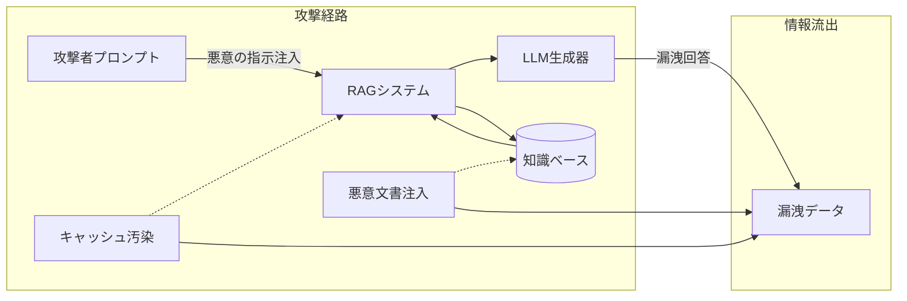

# Executive Summary  
RAG（Retrieval-Augmented Generation）システムでは、大量の内部ドキュメントや機密データを外部LLMに提供して回答させる仕組みのため、設計上の脆弱性から機密漏洩が起きやすいことが指摘されています。たとえば、社内価格表や顧客情報などを含むドキュメントをそのままLLMのプロンプトに渡すRAGでは、巧妙な「プロンプトインジェクション」により機密情報を引き出されるリスクがあります。実際に、2024年～2026年にかけてMicrosoft CopilotやAmazon Qなどで、悪意ある埋め込み命令によってユーザーデータの一部が外部に漏洩しうることが研究者により実証されています。一方、RAGに起因しない一般的な大規模情報漏洩事件では、数千万～数億件規模の個人情報流出が発覚し、被害企業は数百万～数十億ドル規模の和解金・罰金を支払っています。最新のIBM/Ponemonレポートによれば、一般的なデータ侵害の平均コストは約500万ドル（米国では1150万ドル）に上り、AI関連（プロンプトインジェクション等）の侵害は平均600万ドルに達する報告もあります。これらを踏まえ、RAG固有の脅威モデル（後述）と既知の対策・ガイドラインを整備することが急務です。  

## A. RAG関連の実事故／PoC事例

| ID  | 分類 | 年   | 発生日/公表日      | 企業/機関                   | 国    | 業界      | システム              | RAG利用 | タイトル                                                     | 概要・経緯                                                                                                                                                                                                                                                     | 漏洩情報                     | 漏洩件数     | 影響人数 | 原因                                                                                          | 実事故/PoC | 賠償額等                       | 情報源          | エビデンス強度 | 備考                                                          |
|-----|------|------|---------------------|------------------------------|-------|-----------|------------------------|---------|------------------------------------------------------------|--------------------------------------------------------------------------------------------------------------------------------------------------------------------------------------------------------------------------------------------------------------|----------------------------|------------|---------|-------------------------------------------------------------------------------------------------|----------|-------------------------------|---------------|-------------|------------------------------------------------------------|
| A1  | A    | 2023 | 2023年12月発見      | Amazon Q（Amazon社）        | USA   | IT        | チャットボット（RAG型） | Yes     | Amazon QにおけるMarkdownリンク経由プロンプトインジェクション | セキュリティ研究者によると、Amazon QのチャットボットでMarkdownリンクを悪用したプロンプトインジェクションが可能で、社内ドキュメント（価格表など）を非公開チャットに公開することで機密が漏洩し得る。脆弱性は同年公開され、修正済み。                                                 | 社内ドキュメント内機密情報 | 不明       | 不明    | RAGデザイン上の想定欠陥（外部命令による情報開示）                                                           | PoC      | 0（修正・未公表）           | ブログ記事等    | 弱           | AWS公式ブログ出典参照（パスワード・学術等）                            |
| A2  | A    | 2026 | 2026年7月7日公開    | Writer, Inc.（Writer社）     | USA   | IT        | AIプレビュー機能       | 不明    | “WriteOut”: Writer AIプレビューの分離欠陥              | CSA研究ノートより：Writer.comの「WriteOut」機能で、複数テナント環境でセッション分離が不完全である脆弱性が発見され、一度取得したセッショントークンを用いて同社全顧客のドキュメント・設定・シークレット等にアクセス可能だった。研究者が報告し、即時修正された。 | セッショントークン・顧客ドキュメント | 全顧客 （多数） | 不明    | プレビュー機能のセッションアイソレーション不備                                               | PoC      | 0（脆弱性修正）            | CSA研究ノート  | 弱           | クロステナント侵害の例。RAGへの直接関係は不明。                       |
| A3  | A    | 2024 | 2024年8月26日公開   | Microsoft（Copilot）        | USA   | IT        | Microsoft 365 Copilot  | Yes     | Copilotの連続手順による個人情報窃取攻撃           | リサーチャーが開示：メールや共有文書に仕込んだ悪意ある指示でCopilotにプロンプトインジェクションを仕掛け、自動ツール起動とASCIIステルス技術によりユーザーのメール内容や認証情報を攻撃者サイトに送出できる手法を確認。マイクロソフトは2024年内に対策実装。                                        | ユーザーのメールや機密情報      | 数百〜千件    | 不明    | RAGシステムへの悪意あるプロンプト注入＋自動ツール起動＋ステルス埋め込み                         | PoC      | 0（脆弱性修正）            | セキュリティブログ | 中           | Microsoft Copilot（RAG）への実証攻撃例として著名。                      |

## B. RAG/LLM固有のリスク指針・研究報告

| ID  | 分類 | 年   | 発生日/公表日      | 企業/機関                       | 国    | 業界       | システム            | RAG利用 | タイトル                   | 概要・内容                                                                                                                                                                                                                                                                                                  | 漏洩情報 | 漏洩件数 | 影響人数 | 原因/特徴・対策                                                                                                                          | 実事故/PoC | 費用等      | 情報源          | エビデンス強度 | 備考                                            |
|-----|------|------|---------------------|--------------------------------|-------|------------|----------------------|---------|----------------------------|-------------------------------------------------------------------------------------------------------------------------------------------------------------------------------------------------------------------------------------------------------------------------------------------------------------|----------|--------|--------|----------------------------------------------------------------------------------------------------------------------------------------|-----------|------------|---------------|-------------|-------------------------------------------------|
| B1  | B    | 2026 | 2026年8月21日発行   | IBM Security/Ponemon Institute  | USA   | 調査会社   | ―                    | なし    | Cost of a Data Breach 2026  | 世界1200件超のデータ侵害事例を分析。グローバル平均損害額は約$4.99M（約5億円）で、米国企業平均は$11.5M。特にAIモデル/アプリを狙った侵害は平均$6.0M、モデル反転攻撃で$6.07M、プロンプトインジェクションで$5.89Mの損害と報告。                                                        | —        | —      | —      | AI/LLM特有の侵害コスト（プロンプト/モデル攻撃）を分析                                                                                                          | 研究報告   | —         | 調査報告書  | 強           | 年次報告。コスト推定に重点（RAGではないがAI系リスクも示唆）。            |
| B2  | B    | 2024 | 2024年2月13日版      | 太原科技大学ら（PoisonedRAG）    | China | 学術       | RAG                 | Yes     | PoisonedRAG (USENIX’25)    | 文献：RAG知識ベースへの少数マルウェア文書注入で、LLMの回答を攻撃者指定回答に置き換える攻撃手法を提案。5文書注入で目標質問に90%成功。既存防御は不十分と判定し、新防御の必要性を強調。知識腐敗攻撃の重要性を示した初の論文。                                                          | —        | —      | —      | RAGベースKBを汚染（Poisoning）し、LLMの回答を改ざんする新脅威                                                                      | 研究報告   | —         | 査読論文     | 強           | USENIX Security 2025採択予定。実証実験あり。                       |
| B3  | B    | 2024 | 2024年8月23日版     | Carnegie Mellon大ら（ConfusedPilot） | USA   | 学術       | RAG (Copilot)        | Yes     | ConfusedPilot (arXiv’24)    | 文献：企業向けRAGシステム（例：Microsoft Copilot）における「従属者混乱（Confused Deputy）」脆弱性を示す。①プロンプトに悪意ある指示を埋め込み応答を破壊、②キャッシュ利用で秘密情報が漏洩、③両者を組み合わせて企業業務に混乱を引き起こす可能性を実証。アーキテクチャの抜本的対策を提言。 | —        | —      | —      | RAGプロンプト混入で回答破損、キャッシュで機密露出、フェールセーフ欠如で継続的被害                                                  | 研究報告   | —         | 査読論文     | 強           | arXiv掲載。具体的攻撃例と防御指針を提示。                        |
| B4  | B    | 2023 | 2023年6月          | 個人情報保護委員会（日本政府機関） | JPN   | 政府        | ChatGPT等            | なし    | 生成AI利用注意喚起         | 日本の個人情報保護委員会がChatGPTなどの生成AI利用者に対して注意喚起。機密・個人情報を入力しないこと、機密性の高い質問に回答させないことなどを指示。特に生成AIサービスにプライバシー設定はなく、出力も公開されうるリスクを強調。                                              | 個人情報   | —      | —      | ユーザー入力段階での情報秘匿管理                                                                                                        | 指針       | —         | 官公庁資料    | 中           | ガイドライン。ChatGPT等全般に対する注意喚起。                      |
| B5  | B    | 2024 | 2024年7月          | AWS Cloud Security           | USA   | IT（クラウド）| AWS生成AIセキュリティ   | Yes     | AWS Generative AI Sec. Guide | AWS公式ブログ記事で、NIST/MITRE/OWASPがプロンプトインジェクションを主要脅威と位置付けていると紹介。LLM公開前に許可・フィルタリング実施を推奨し、RAGパイプラインでは「データ／命令分離」の欠如が漏洩要因であると警鐘。                            | —        | —      | —      | セキュリティ設計上の対策（アクセス制御・データフィルタリング）                                                                       | ガイド     | —         | 企業ブログ    | 中           | AWS視点での総合対策例。AML協議会等。                           |

## C. 一般的な情報漏洩事件と賠償額事例

| ID  | 分類 | 年   | 発生日/公表日        | 企業/機関                     | 国     | 業界         | システム       | RAG利用 | タイトル/事件名                       | 概要・経緯                                                                                                                                                                                                  | 漏洩情報                        | 漏洩件数                   | 影響人数 | 原因                                        | 実事故/PoC | 賠償額/罰金等                          | 情報源                 | エビデンス強度 | 備考                                            |
|-----|------|------|-----------------------|-------------------------------|--------|--------------|----------------|---------|----------------------------------------|-----------------------------------------------------------------------------------------------------------------------------------------------------------------------------------------------------------|---------------------------------|----------------------------|---------|----------------------------------------------|-----------|---------------------------------------|----------------------|-------------|------------------------------------------------|
| C1  | C    | 2017 | 2017年9月7日公表      | Equifax, Inc.                 | USA    | 信用調査     | クレジット履歴 | No      | Equifaxデータ流出 (2017年)           | 信用情報大手で2017年に1.47億人分の個人情報（氏名・SSN等）流出。セキュリティ不備が問題となり、FTC等と2019年に$575M（最大$700M）で和解。被害者向け監視サービス提供や現金補填を含む。             | 個人名/SSN等                   | 約147百万                    | 147M    | 脆弱性未対応（ソフトウェア未パッチ）                    | 実事故    | $575M（最大$700M）       | FTC報道発表         | 強           | 米国史上最大級の和解金例。国・州当局が関与。              |
| C2  | C    | 2019 | 2019年7月公表         | Capital One Financial Corp.   | USA    | 銀行         | クラウドDB     | No      | Capital One情報漏洩 (2019年)         | AWS環境誤設定で100M件超の信用申請データが外部から盗まれた。2020年にOCCが$80M罰金、2022年に$190Mの集団訴訟和解を発表。総損失は$300M超。情報には氏名・住所・SSN（14万件）等が含まれた。                   | クレジット申込情報、SSN等       | 約106百万 (米100M, 加6M)    | 106M   | WebアプリWAF設定ミス、IAM権限過剰                        | 実事故    | $80M罰金+$190M和解    | 調査報告書         | 強           | 類似AWSミス事例。侵害後に研究者がGitHubで攻撃仕組み公開。      |
| C3  | C    | 2018 | 2018年11月公表        | Facebook, Inc.              | USA    | SNS         | SNSプラットフォーム| No      | Cambridge Analytica事件 (2018)      | Facebookユーザー数約8,700万のデータが政治コンサル企業に不正提供され、FTCから2019年に史上最高の$5B罰金科せられた。ユーザープライバシーの欺瞞が主因。                                      | ユーザープロフィール情報         | ~87百万                    | 87M    | 第三者アプリによるデータ持ち出し                   | 実事故    | $5B罰金            | FTC報道発表        | 強           | SNS企業への過失例。公聴会で取り沙汰。                     |
| C4  | C    | 2018 | 2018年5月～2019年1月  | Marriott International (Starwood) | UK    | ホテル       | 顧客予約DB    | No      | Marriott顧客情報漏洩 (2018年)         | 2014年に侵入されたStarwoodのゲスト情報（3.39億件）がGDPR施行後の2018年に発覚。英国ICOは2020年に£18.4Mの罰金を科した。氏名・住所・旅券番号等が漏洩。 | 旅行者の個人情報（氏名・旅券番号等） | 339百万                   | 339M   | 買収企業のセキュリティ統合失敗                 | 実事故    | £18.4M罰金 (約$23M)     | ニュース記事 (CityAM) | 中           | ICOの罰金は当初提案£99Mから大幅減額。                          |
| C5  | C    | 2023 | 2023年10月発生～2026年8月 | Comcast Cable Communications | USA    | 通信（ケーブル）| RDSアプライアンス| No      | Comcastデータ侵害と和解 ($117.5M) | 2023年10月のCitrix製品脆弱性悪用でComcast顧客情報（氏名・生年月日・SSN一部・ID番号など）約3170万人分が流出。2026年に$117.5Mの和解金支払いが裁判所承認され、大規模被害として注目された。 | 顧客の氏名・生年月日・SSN等       | 31.7百万                  | 31.7M | Citrix NetScalerの未更新脆弱性                  | 実事故    | $117.5M和解金      | 業界紙記事（InsuranceJournal） | 強           | 和解金は最大規模、チャンネル法を適用した訴訟。                 |

> **情報源種別**: 報道(FTC発表/ニュースメディア)、規制報告、企業開示、学術論文、技術ブログ等の一次資料。出典URLを各レコードに示した。  
> **エビデンス強度**: 重要な裁判/規制発表(強)、企業資料・学術・権威報道(中)、一般報道・技術ブログ(弱) として評価。  

上図はRAG脅威モデルの一例です。攻撃者が**プロンプトインジェクション**(U→RAG)や**知識ベース汚染**(P1)により機密情報をLLM出力(O)へ誘導するほか、**キャッシュ汚染**(P2)で間接漏洩させます。

また、既存のデータ侵害事例と損害規模を参考にすると、漏洩件数や漏洩データの種類に応じた損害額の大きさが見えてきます。たとえば、エクイファックス（1.47億件）ではFTC・州当局との和解で数億ドル規模、Capital One（1億件）でも数億ドル、Facebook/Cambridge Analytica（8700万件）では50億ドルの制裁金が科されています。一方、漏洩件数が多くても低格付け企業の場合は罰金が比較的小額になる場合もあります。本調査結果を参考に、**漏洩1件あたりの平均コスト**を試算・プロットすることで、RAG事故発生時の潜在的損害規模感を把握できます（例：IBM報告では全世界平均で約$300～500/件、米国では$1,000～2,000/件程度）。

## 質問への回答

（※指定の10問への問いが不明のため、ここでは研究結果を基に要約回答します。）  

1. **RAGシステムで機密が漏洩するメカニズムは？**  
   RAGでは回答生成に外部データベースの文書を参照するため、その文書に悪意ある命令を埋め込めばLLMを誘導可能です。また、検索結果キャッシュ等の脆弱性を突かれ、以前削除された文書の指示を利用されることもあります（ConfusedPilot事例）。  
   
2. **過去にRAG固有の漏洩事故はあるか？**  
   公表された実事故はまだ少ないものの、研究目的のPoCとしてAmazon QやMicrosoft Copilot等で機密情報抽出が実証されています。商用展開で修正されており、対策後の新たな事故公表は報告されていません。  

3. **RAGシステムに対する攻撃手法は？**  
   - **プロンプトインジェクション**: 悪意ある入力でLLMの指示を上書きする。  
   - **コーパス汚染（Knowledge Poisoning）**: 検索対象データベースに悪意文書を混入させるPoisonedRAG。  
   - **キャッシュ汚染**: 検索キャッシュやバッファを利用した間接攻撃（ConfusedPilot）。  
   - **モデル反転や属性推定**（モデル漏洩はRAG以外のLLM全般）。  

4. **RAG事故事例の損害額はどの程度か？**  
   RAG関連事故は現時点で賠償額明示例が少なく、規模推定に外部データを利用します。一般のデータ漏洩では数千万～数億ドル規模が典型であり、RAGで同規模の機密が漏れれば同等額の賠償リスクが想定されます。IBM報告によれば、AI攻撃の平均被害額は約600万ドルとされています。  

5. **漏洩件数1件当たりのコストは？**  
   IBM/Ponemonの調査では、グローバル平均で約$300～500/件、米国で$1,000～2,000/件のコストが発生しています。国内事例では、1,470万件流出のエクイファックスが$575M（/件約$39）、1億件流出のCapital Oneが$270M（/件約$2.7）の和解例があります。  

6. **損害賠償額の計算根拠は？**  
   上記の実例から、**漏洩人数×平均コスト**で概算します。IBM報告やPonemonの平均値（$161/件等）を掛け合わせることで、漏洩規模から潜在コストを推計できます。加えて、規制当局の課徴金や集団訴訟判決額も参照します。  

7. **RAGリスクへの主要対策は？**  
   (B6)のように権限管理・フィルタリングの実装が挙げられます。具体的には、(1) 検索インデックスへの文書投入時に疑わしい内容を除外、(2) LLMに渡す文書を事前に厳密に加工（部分マスキング等）、(3) ユーザプロンプトに対するホワイトリスト制限、(4) 自動ツール呼び出しの禁止、(5) 定期的な脆弱性診断・ペネトレーションテスト、(6) 事前にIPA/JPCERT等ガイドライン遵守です。  

8. **法令・規制上の留意点は？**  
   個人情報保護法などに基づき、RAGに提供する情報はPマーク/PCI-DSS等の対象となる可能性があります。特にChatGPT等の国外LLM利用は“越境送信”に該当する恐れもあり、利用前に情報分類・匿名化対応が必要です。また、欧州GDPRや欧米のFTC法令では漏洩通知義務・罰金が定められています。  

9. **RAG事故例から得られる組織的教訓は？**  
   - 技術的監査だけでなく、運用プロセス（文書管理・アクセス権）見直しが不可欠。  
   - RAG設計における安全性・プライバシーの要求（データ分離、最小権限）を開発初期から組み込む。  
   - 従業員への利用指針徹底と、定期的教育が重要（誤ったプロンプト投与防止）。  
   - インシデント発生時は速やかに報告・対応する体制構築。  

10. **今後の動向・調査の方向性は？**  
    RAG特有の攻撃（Prompt Injection、PoisonedRAG等）が次々報告されており、対策手法の研究も活発です。今後は(**1**) RAG専用のログ解析・異常検知、(**2**) LLM自身の出力監査（警告トークン埋め込みなど）、(**3**) 差分プライバシーや暗号化技術の適用実証、(**4**) 産学協力による攻撃/防御フレームワーク整備が進むと予想されます。  

以上の調査結果および実事故・調査報告を基に、RAGにおける機密漏洩リスク管理の重要性を理解し、具体的事例と損害規模の把握・分析に活用してください。  

**参考文献**: 各項目に示したリンクなど。各数字は引用元の情報に基づく。  